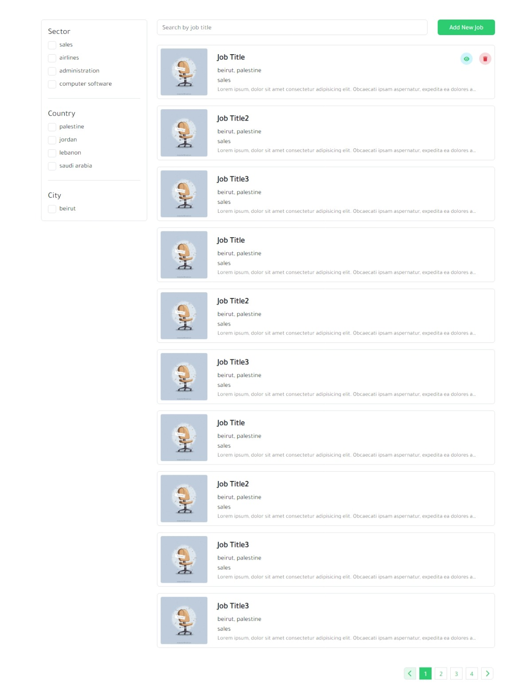
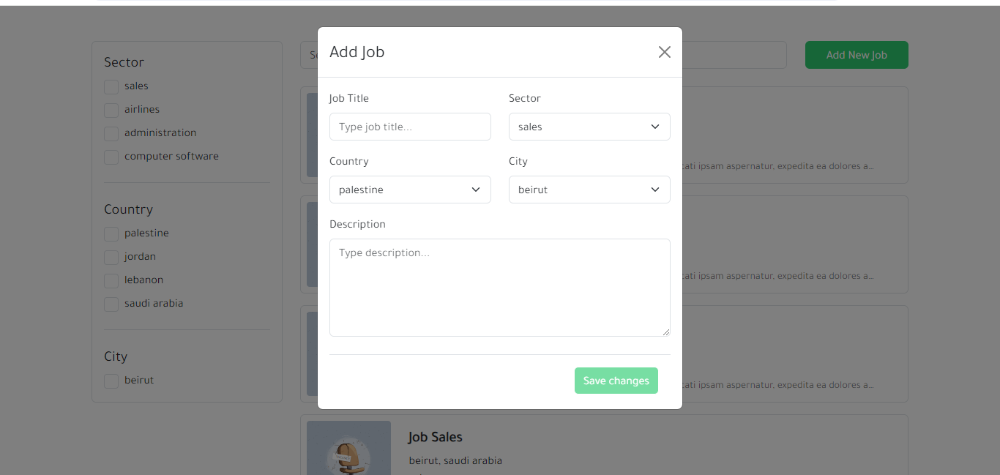
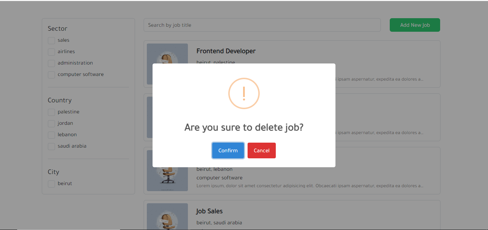
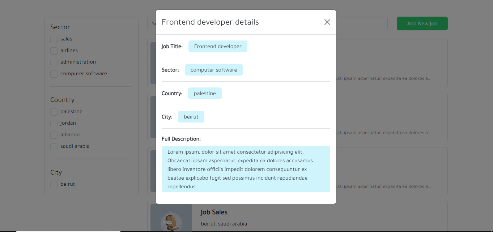

# JOB Post

This repository contains the source code for an Angular app.

## Prerequisites

Before you begin, ensure you have the following installed on your machine:

- Node.js: [Download and install Node.js](https://nodejs.org/)
- npm (Node Package Manager): Included with Node.js installation

## Getting Started

Follow these steps to set up and run the Angular app:

1. **Clone the Repository:**

   ```bash
   git clone https://github.com/your-username/your-angular-app.git
   cd your-angular-app

2. **Install Dependencies::**

   ```bash
   npm install

3. **Run the Development Server:**

   ```bash
   ng serve --o

## Screenshots of the final result

   ```bash
   
   
   

   

   
